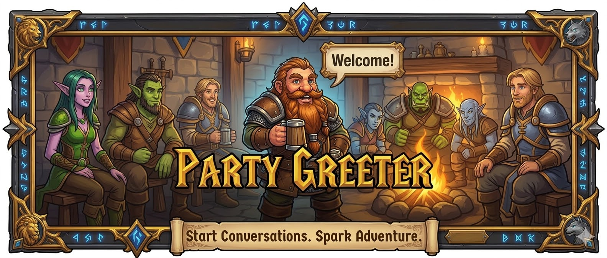

# Party Greeter

Party Greeter is a lightweight World of Warcraft addon that automatically welcomes new players when they join your party or raid.
Start conversations quickly without typing every message by hand.

## Key Features

- Automatically detects when players join your party or raid.
- Configurable, randomized greetings and group terms.
- Smart delays to avoid chat spam.
- Clean native Blizzard settings UI (no third-party config UI libraries).

## Installation

### CurseForge / Wago

- CurseForge: Not published yet.
- Wago: Not published yet.

### Manual GitHub Installation

1. Download the project ZIP: <https://github.com/Willtl/PartyGreeter/archive/refs/heads/main.zip>
2. Extract the ZIP.
3. Place the `PartyGreeter` folder directly in:
   `World of Warcraft\_retail_\Interface\AddOns\`
4. Confirm this file exists:
   `World of Warcraft\_retail_\Interface\AddOns\PartyGreeter\PartyGreeter.toc`
5. Start the game (or run `/reload` if already in-game).

## Usage & Configuration

1. Open the game menu with `ESC`.
2. Go to `Options -> AddOns -> Party Greeter`.
3. Configure greetings, group terms, and delay behavior.

You can also open settings from the modern minimap Addon Compartment dropdown when the addon entry is available in your build/package.

## Slash Commands

- `/partygreeter` - Open settings.
- `/pg` - Open settings.

## Feedback & Bug Reports

If something breaks or behaves unexpectedly, report it here:
<https://github.com/Willtl/PartyGreeter/issues>
